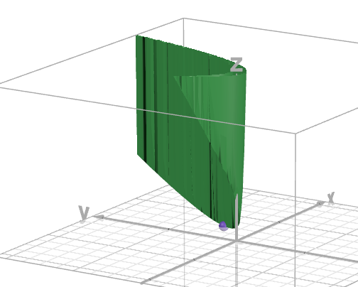
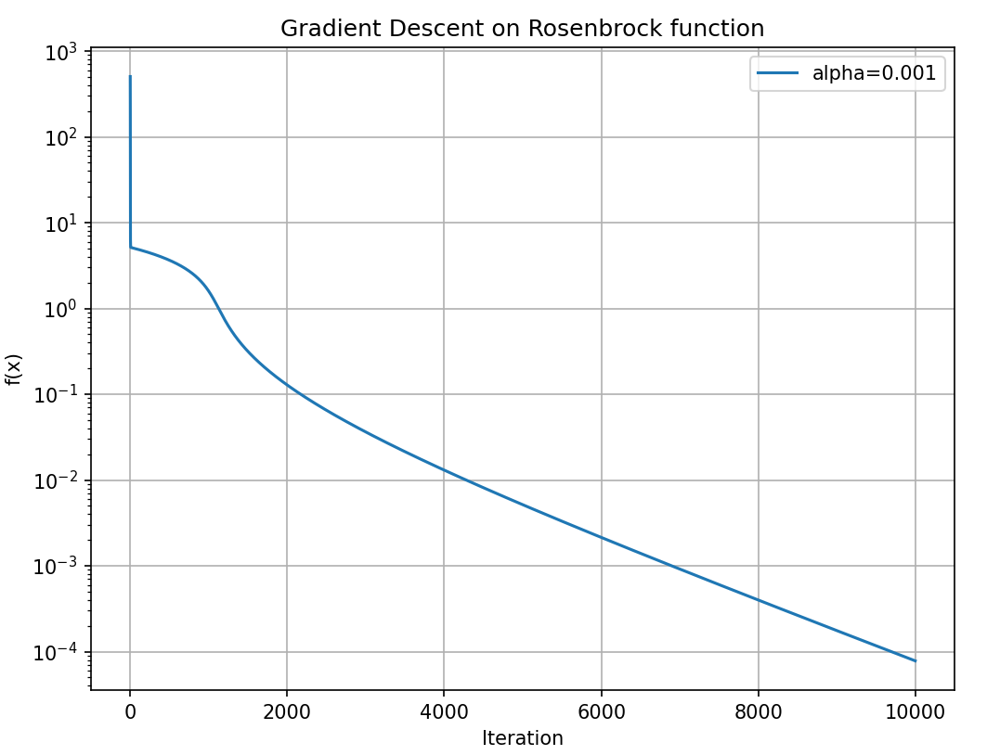
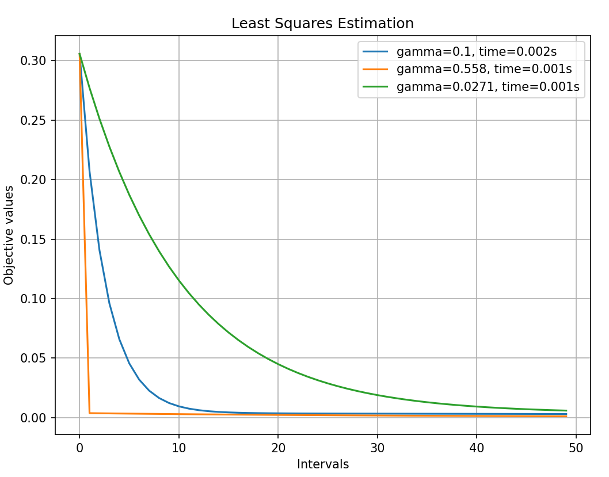
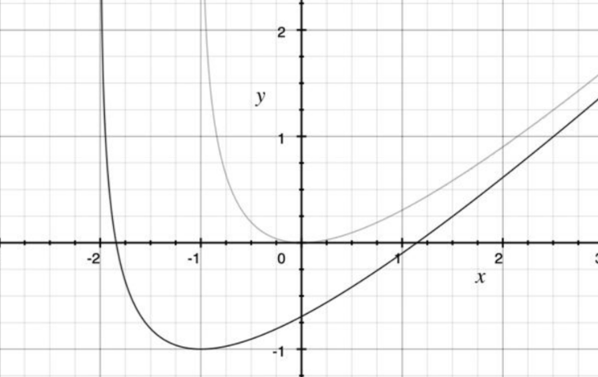
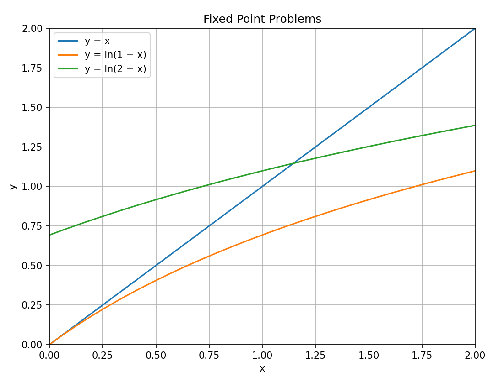
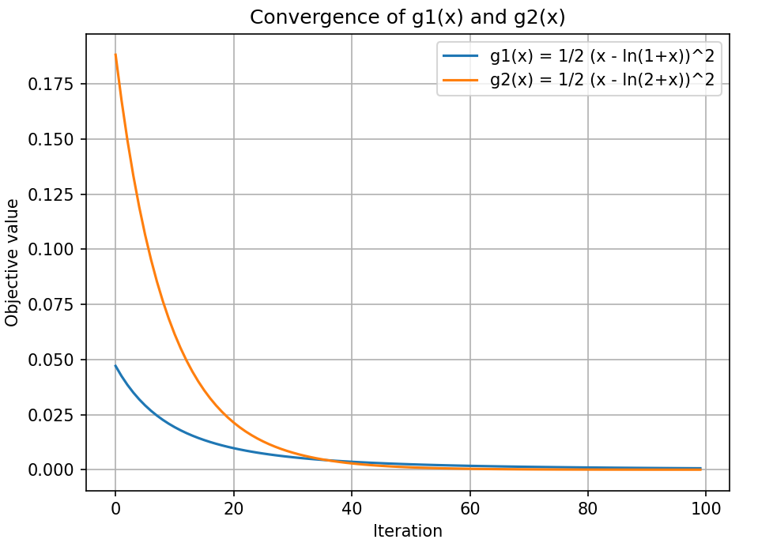

# Rosenbrock function

We implement gradient descent for minimization Rosenbrock function.
$100 \times  (y - x^2)^2 + (1 - x)^2$



This function has global min in point (1, 1).

We don't find the solution with step_size = 0,1 and step_size = 0,01. Because these steps
are too large. So we worked only with step_size = 0,001. 

---

```def calculate_objective(X):``` function accepts a vector as an input, and return the f(x, y). 

```def compute_gradient(X):``` function accepts a vector as an input, and return gradient 
$\begin{vmatrix}
\frac{df}{dx}&\frac{df}{dy}\\
\end{vmatrix} $

```def gradient_descent(x, step, iter, tol):``` function accepts a start point,  
a step, max number of iteration, and a tolerance as an input, and returns: $x_{history}$, $f_{history}$, i+1, end_time  
where $x_{history}$ it is a list with all point x that we used, $f_{history}$ is also list but for value of a function,
i+1 it's number of iteration that do, and end_time it's time that our program worked.
The last element in $x_{history}$ is the point where the descent stopped.


---


```
if np.linalg.norm(grad) <= tol:
        break
   ```
Here we check norm of our gradient and if it less/equal to 0.0001 then we stopped.
 
And this:  ```x_current = x_current - step * grad```
is the same as this: $x_{k+1} = x_k - \alpha∇f(x_k)$

---



Results for different step size: 

| Step size:              | 0.001                |
|-------------------------|----------------------|
| Number of iterations:   | 10000                |
| Time spent:             | 0.3144               |
| Final point:            | [0.9911 0.9823]      |
| Final objective value:  | 7.80397926096646e-05 |

---

We can coclude that Rosenbrock function is a good example that shows the importance of selecting proper descend step. 
Big steps may lead to mis-convergence (sometimes referred as overshooting). Small steps will lead to excessive time.


# Least Squares Estimation
Calculates the least-squares objective:
$f(x) = \frac{1}{2m} \times ||A x - b||^2$, where m = number of rows in matrix_A.

Computes the gradient of the least-squares objective:
$grad f(x) = \frac{1}{m} \times A^T (A x - b)$, (m the same).


Let's take random matrix A as follows:

$\begin{vmatrix}
0.822&0.034&0.784&0.331&0.435\\
0.707&0.576&0.227&0.022&0.788\\
0.997&0.902&0.929&0.493&0.566\\
0.095&0.819&0.804&0.653&0.516\\
\end{vmatrix} $

And a random vector b as follows:

$\begin{vmatrix}
0.694 \\
0.701 \\
0.906 \\
0.805 \\
\end{vmatrix} $

---

For all functions ```m = A.shape[0]``` and in our case it's 4.

```def calculate_objective(A, b, x):``` 

$Ax-b =\begin{vmatrix}
0.822&0.034&0.784&0.331&0.435\\
0.707&0.576&0.227&0.022&0.788\\
0.997&0.902&0.929&0.493&0.566\\
0.095&0.819&0.804&0.653&0.516\\
\end{vmatrix} 
\times
\begin{vmatrix}
x_1 \\
x_2 \\
x_3 \\
x_4 \\
x_5 \\
\end{vmatrix} -
\begin{vmatrix}
0.694 \\
0.701 \\
0.906 \\
0.805 \\
\end{vmatrix}$

$f(x) = \frac1{2m}||Ax-b||^2$

We use to calculate scalar value of function that we minimized.

```def compute_gradient(A, b, x):```

$∇f(x) = \frac1m A^T(Ax-b) =
\begin{vmatrix}
0.822 & 0.707 & 0.997 & 0.095 \\
0.034 & 0.576 & 0.902 & 0.819 \\
0.784 & 0.227 & 0.929 & 0.804 \\
0.331 & 0.022 & 0.493 & 0.653 \\
0.435 & 0.788 & 0.566 & 0.516 \\
\end{vmatrix}
\times
(\begin{vmatrix}
0.822&0.034&0.784&0.331&0.435\\
0.707&0.576&0.227&0.022&0.788\\
0.997&0.902&0.929&0.493&0.566\\
0.095&0.819&0.804&0.653&0.516\\
\end{vmatrix} 
\times
\begin{vmatrix}
x_1 \\
x_2 \\
x_3 \\
x_4 \\
x_5 \\
\end{vmatrix} -
\begin{vmatrix}
0.694 \\
0.701 \\
0.906 \\
0.805 \\
\end{vmatrix})$

We use for update the vector $\overline{x}$.

```def gradient_descent(A, b, x0, step, iter):``` In this method we don't need to check something,
we just need to do iters iterations.

```x = x - step * grad``` = $x_{k+1} = x_k - \gamma∇f(x_k)$. For the first iteration we 
$\overline x = \begin{vmatrix}
0 \\
0 \\
0 \\
0 \\
0 \\
\end{vmatrix}$


---

```
spectral_norm_A = np.linalg.norm(matrix_A, 2)
L1 = (spectral_norm_A ** 2) / m 
```

```
AtA = matrix_A.T @ matrix_A
Atb = matrix_A.T @ b
norm_AtA = np.linalg.norm(AtA, 2)
norm_Atb = np.linalg.norm(Atb, 2)

L2 = (1 / m) * (norm_AtA * 20 + norm_Atb) # ||x|| < 20
```
Now that we have calculated Lipschen constants we can identify our steps: ```step_size = [0.1, 1/L1, 1/L2]```

---



| Step size          | 0.1     | L1: | Step size          | 0.558   | L2: | Step size          | 0.0271  |
|--------------------|---------|-----|--------------------|---------|-----|--------------------|---------|
| final objective    | 0.00301 |     | final objective    | 0.00108 |     | final objective    | 0.00587 |
| runtime (50 iters) | 0.002 s |     | runtime (50 iters) | 0.001 s |     | runtime (50 iters) | 0.001 s |

---

Important conclusion might be that gradient descend method might be applied to functions that have non-scalar nature.

Another conclusion is that Lipschitz constant quantifies smoothness of our function. 
If the step size is too large relative to the Lipschitz constant, the algorithm might overshoot

# Fixed Point Problem

We apply gradient descent for minimization two functions $g_1(x)$ and $g_2(x)$.

$g_1(x) = \frac12 (x - ln(1 + x))^2$

$g_2(x) = \frac12 (x - ln(2 + x))^2$



---

```def calculate_objective(X, function):``` Function takes as input: x - the current value of the variable, and a function: g1(x) or g2(x).
And returns calculated scalar value.

```def compute_gradient(X, function):``` Function takes the same input as above. Returns calculated value of gradient vector in given point.

```def gradient_descent(X0, function, step, iters):``` The first two arguments are the same as above. The third argument is algorithm step. The last argument is the number of iterations.
Function returns: minimized X, history of possible values X, and time.

---



###  Gradient Descent for $g_1(x) =\frac12 (x - ln(1 + x))^2 $ 

| Initial gess | Step size | Final solution $x^*$ | Final $g_1(x^*)$ | Total time |
|--------------|-----------|----------------------|------------------|------------|
| 1            | 0.2       | 0.02655              | 0.0014           | 0.0020     |


### Selected iteration snapshots for $g_1(x)$:

| Iterations |     0      |     10     |     20     |     30     |     40     |     50     |     60     |     70     |     80     |     90     |  
|------------|:----------:|:----------:|:----------:|:----------:|:----------:|:----------:|:----------:|:----------:|:----------:|:----------:|  
| x          |   1.0000   |   0.7643   |   0.6257   |   0.5347   |   0.4703   |   0.4222   |   0.3848   |   0.3548   |   0.3301   |   0.3095   |  
| $g_1(x)$   | 4.7079e-02 | 1.9311e-02 | 9.7676e-03 | 5.6582e-03 | 3.5990e-03 | 2.4496e-03 | 1.7547e-03 | 1.3078e-03 | 1.0060e-03 | 7.9413e-04 |  


###  Gradient Descent for $g_2(x) = \frac12 (x - ln(2 + x))^2$

| Initial gess | Step size | Final solution $x^*$ | Final $g_2(x^*)$ | Total time |
|--------------|-----------|----------------------|------------------|------------|
| 2            | 0.1       | 1.152                | 0.0000           | 0.0030     |

### Selected iteration snapshots for $g_2(x)$:

| Iterations |     0      |     10     |     20     |     30     |     40     |     50     |     60     |     70     |     80     |     90     |  
|------------|:----------:|:----------:|:----------:|:----------:|:----------:|:----------:|:----------:|:----------:|:----------:|:----------:|  
| x          |   2.0000   |   1.6438   |   1.4432   |   1.3261   |   1.2562   |   1.2139   |   1.1880   |   1.1720   |   1.1622   |   1.1561   |  
| $g_2(x)$   | 1.8832e-01 | 6.1515e-02 | 2.1381e-02 | 7.7280e-03 | 2.8624e-03 | 1.0764e-03 | 4.0866e-04 | 1.5606e-04 | 5.9813e-05 | 2.2977e-05 |  




