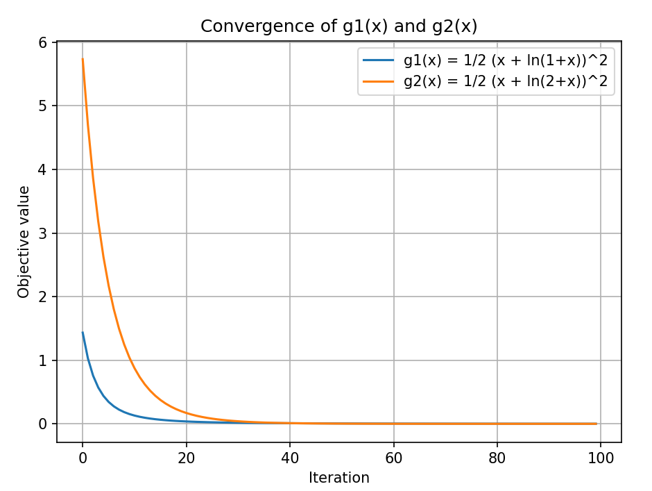

# Rosenbrock function

We implement gradient descent for minimization Rosenbrock function.
$100 \times  (y - x^2)^2 + (1 - x)^2$


This function has global min in point (1, 1).

We don't find the solution with step_size = 0,1 and step_size = 0,01. Because these steps
are too large. So we worked only with step_size = 0,001. 

---

```def calculate_objective(X):``` function is accepted a vector as an input, and return the f(x, y). 

```def compute_gradient(X):``` function is accepted a vector as an input, and return gradient 
$\begin{vmatrix}
\frac{df}{dx}&\frac{df}{dy}\\
\end{vmatrix} $

```def gradient_descent(x, step, iter, tol):``` function is accepted a start point,  
a step, max number of iteration, and a tolerance as an input, and return: $x_{history}$, $f_{history}$, i+1, end_time  
where $x_{history}$ it is a list with all point x that we used, $f_{history}$ is also list but for value of a function,
i+1 it's number of iteration that do, and end_time it's time that our program worked.

---


```
if np.linalg.norm(grad) <= tol:
        break
   ```
Here we check norm of our gradient and if it less/equal to 0.0001 then we stopped.
 
And this:  ```x_current = x_current - step * grad```
is the same as this: $x_{k+1} = x_k - \alpha∇f(x_k)$

---


Results for different step size: 

| Step size:              | 0.001                |
|-------------------------|----------------------|
| Number of iterations:   | 10000                |
| Time spent:             | 0.3144               |
| Final point:            | [0.9911 0.9823]      |
| Final objective value:  | 7.80397926096646e-05 |

# Least Squares Estimation
Calculates the least-squares objective:
$f(x) = \frac{1}{2m} \times ||A x - b||^2$, where m = number of rows in matrix_A.

Computes the gradient of the least-squares objective:
$grad f(x) = \frac{1}{m} \times A^T (A x - b)$, (m the same).


Our matrix A looks like:

$\begin{vmatrix}
0.822&0.034&0.784&0.331&0.435\\
0.707&0.576&0.227&0.022&0.788\\
0.997&0.902&0.929&0.493&0.566\\
0.095&0.819&0.804&0.653&0.516\\
\end{vmatrix} $

And our vector b looks like:

$\begin{vmatrix}
0.694 \\
0.701 \\
0.906 \\
0.805 \\
\end{vmatrix} $

---

For all functions ```m = A.shape[0]``` and in our case it's 4.

```def calculate_objective(A, b, x):``` 

$Ax-b =\begin{vmatrix}
0.822&0.034&0.784&0.331&0.435\\
0.707&0.576&0.227&0.022&0.788\\
0.997&0.902&0.929&0.493&0.566\\
0.095&0.819&0.804&0.653&0.516\\
\end{vmatrix} 
\times
\begin{vmatrix}
x_1 \\
x_2 \\
x_3 \\
x_4 \\
x_5 \\
\end{vmatrix} -
\begin{vmatrix}
0.694 \\
0.701 \\
0.906 \\
0.805 \\
\end{vmatrix}$

$f(x) = \frac1{2m}||Ax-b||^2$

We use to calculate scalar value of function that we minimized.

```def compute_gradient(A, b, x):```

$∇f(x) = \frac1m A^T(Ax-b) =
\begin{vmatrix}
0.822 & 0.707 & 0.997 & 0.095 \\
0.034 & 0.576 & 0.902 & 0.819 \\
0.784 & 0.227 & 0.929 & 0.804 \\
0.331 & 0.022 & 0.493 & 0.653 \\
0.435 & 0.788 & 0.566 & 0.516 \\
\end{vmatrix}
\times
(\begin{vmatrix}
0.822&0.034&0.784&0.331&0.435\\
0.707&0.576&0.227&0.022&0.788\\
0.997&0.902&0.929&0.493&0.566\\
0.095&0.819&0.804&0.653&0.516\\
\end{vmatrix} 
\times
\begin{vmatrix}
x_1 \\
x_2 \\
x_3 \\
x_4 \\
x_5 \\
\end{vmatrix} -
\begin{vmatrix}
0.694 \\
0.701 \\
0.906 \\
0.805 \\
\end{vmatrix})$

We use for update the vector $\overline{x}$.

```def gradient_descent(A, b, x0, step, iter):``` In this method we don't need to check something,
we just need to do iters iterations.

```x = x - step * grad``` = $x_{k+1} = x_k - \gamma∇f(x_k)$. For the first iteration we 
$\overline x = \begin{vmatrix}
0 \\
0 \\
0 \\
0 \\
0 \\
\end{vmatrix}$


---

```
spectral_norm_A = np.linalg.norm(matrix_A, 2)
L1 = (spectral_norm_A ** 2) / m 
```

```
AtA = matrix_A.T @ matrix_A
Atb = matrix_A.T @ b
norm_AtA = np.linalg.norm(AtA, 2)
norm_Atb = np.linalg.norm(Atb, 2)

L2 = (1 / m) * (norm_AtA * 20 + norm_Atb) # ||x|| < 20
```
Now that we have calculated Lipschen constants we can identify our steps: ```step_size = [0.1, 1/L1, 1/L2]```

---


| Step size          | 0.1     | L1: | Step size          | 0.558   | L2: | Step size          | 0.0271  |
|--------------------|---------|-----|--------------------|---------|-----|--------------------|---------|
| final objective    | 0.00301 |     | final objective    | 0.00108 |     | final objective    | 0.00587 |
| runtime (50 iters) | 0.002 s |     | runtime (50 iters) | 0.001 s |     | runtime (50 iters) | 0.001 s |


# Fixed Point Problem


### === Gradient Descent for g1(x) = $\frac12 (x + ln(1 + x))^2 $ === 

Initial gess: 1, Step size: 0.2

final solution: $x^*$ = 0.02655

Final $g1(x^*)$: 0.0014

Total time: 0.0020


### Selected iteration snapshots for g1(x):

Iterations:    0, x = 1.0000, g1(x) = 1.4334e+00

Iterations:   10, x = 0.2700, g1(x) = 1.2955e-01

Iterations:   20, x = 0.1406, g1(x) = 3.7046e-02

Iterations:   30, x = 0.0931, g1(x) = 1.6569e-02

Iterations:   40, x = 0.0690, g1(x) = 9.2205e-03

Iterations:   50, x = 0.0547, g1(x) = 5.8267e-03

Iterations:   60, x = 0.0452, g1(x) = 3.9992e-03

Iterations:   70, x = 0.0385, g1(x) = 2.9081e-03

Iterations:   80, x = 0.0335, g1(x) = 2.2067e-03

Iterations:   90, x = 0.0296, g1(x) = 1.7301e-03

### === Gradient Descent for $g2(x) = \frac12 (x + ln(2 + x))^2 ===$

Initial gess: 2, Step size: 0.1

final solution: $x^*$ = -0.4407

Final $g1(x^*)$: 0.0000

Total time: 0.0010

### Selected iteration snapshots for g2(x):

Iterations:    0, x = 2.0000, g1(x) = 5.7335e+00

Iterations:   10, x = 0.4331, g1(x) = 8.7417e-01

Iterations:   20, x = -0.0729, g1(x) = 1.7001e-01

Iterations:   30, x = -0.2675, g1(x) = 3.9782e-02

Iterations:   40, x = -0.3541, g1(x) = 1.0384e-02

Iterations:   50, x = -0.3964, g1(x) = 2.8789e-03

Iterations:   60, x = -0.4180, g1(x) = 8.2472e-04

Iterations:   70, x = -0.4295, g1(x) = 2.4049e-04

Iterations:   80, x = -0.4356, g1(x) = 7.0810e-05

Iterations:   90, x = -0.4389, g1(x) = 2.0959e-05


