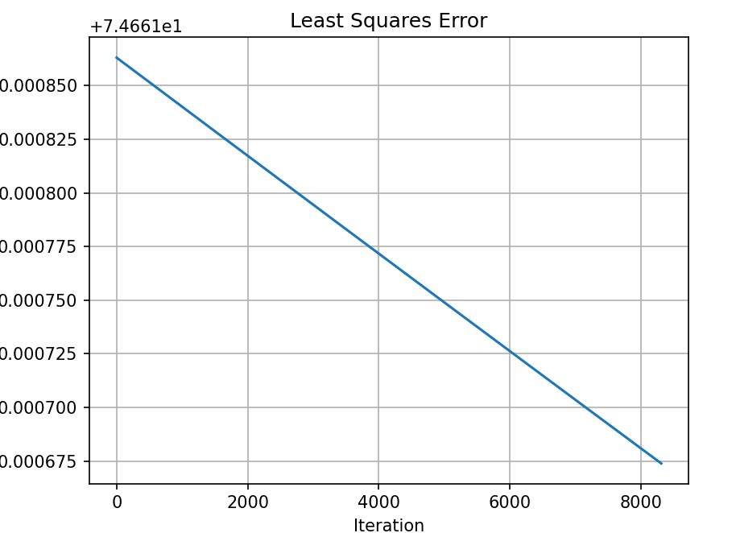
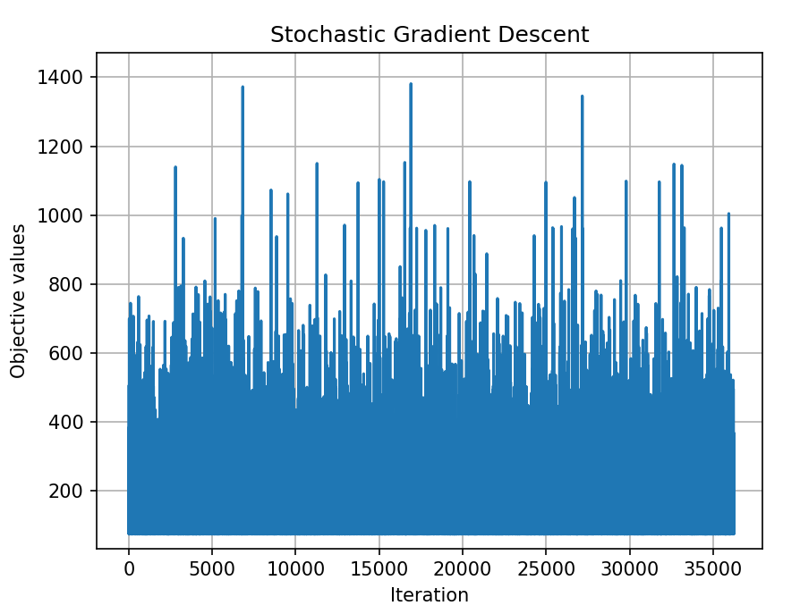
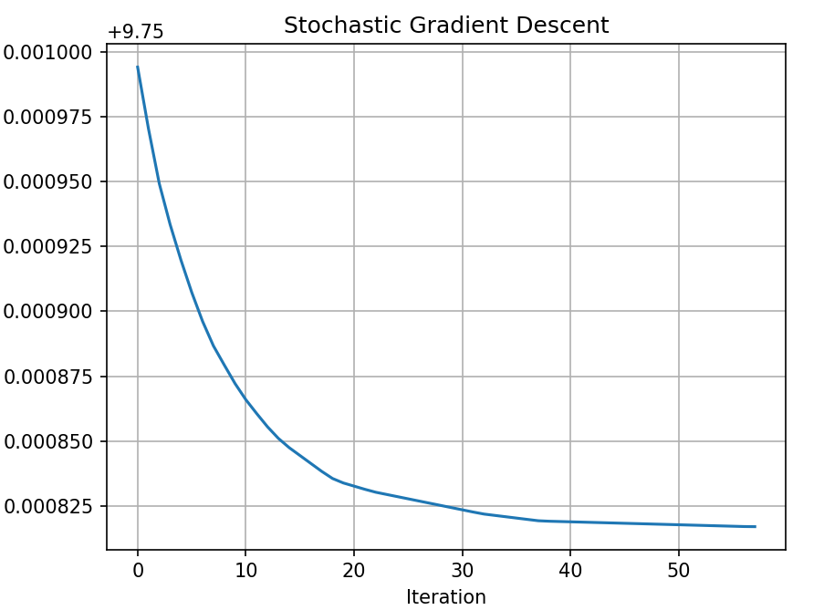
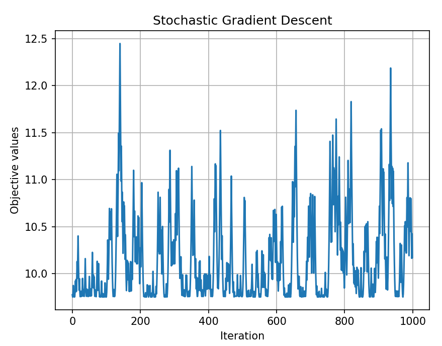

In this labwork we used the dataset
https://www.kaggle.com/datasets/sonalisingh1411/genderheightweightcsv

Based on it we created two matrices with heights (matrix_x) and weights (y). Our task is to find $\omega$ matrix so that
$S(\omega) = \frac1{2n}||y - X\omega||^2 \rightarrow min$  

matrix_X = $\begin{bmatrix}
1& 73.85 \\
1& 68.78 \\
1& 74.11 \\
...& ... \\
1& 63.87 \\
1& 69.03 \\
1& 61.94 \\
\end{bmatrix} $ , y = $\begin{bmatrix}
241.89 \\
162.31 \\
212.74 \\
...    \\
128.48 \\
163.85 \\
113.65 \\
\end{bmatrix}$ , w = $\begin{bmatrix}
w_1 \\
w_2 \\
\end{bmatrix}$

Step was calculated as:  0.00022622122881210642

***
# Mean Square Error

In file Mean_Square_Error.py we defined `calculate_objective`, `compute_gradient` and `gradient_descent`
functions which performs gradient descent at step k.

We began with $w_0 = \begin{bmatrix}
-310 \\ 
10\\
\end{bmatrix}$, after 1 million iteration `Gradient norm = 0.030412` it's still grater than 1e-2. 

So let's continue, now our $w_1 = \begin{bmatrix}
-331.51353735 \\ 
7.42860317 \\
\end{bmatrix}$, and again after 1 million iteration `Gradient norm = 0.014367 > 1e-2`. 

Change w and run again.
$w_2 = \begin{bmatrix}
-346.44723667\\ 
7.65286475 \\
\end{bmatrix}$ finally `Gradient norm = 0.00999 < 1e-2` $w_{min} = 
\begin{bmatrix}
-347.73228169 \\ 
7.67216246 \\
\end{bmatrix}$.

The algorithm made 2,478,312 iteration. 

***
# Stochastic Gradient Descent

Next we implemented stochastic gradient descent. Code is in Stochastic_gradient_descent.py. The index i was selected randomly from 1...n.

Based on previous task we selected $w_0 = \begin{bmatrix}
-346.44723667 \\ 
7.65286475 \\
\end{bmatrix}$.

Now `Gradient norm = 0.00256 < 1e-2`, we made 36252 iteration, and $w_{min} = 
\begin{bmatrix}
-346.57770414 \\ 
7.54741605 \\
\end{bmatrix}$.

The algorithm is not deterministic in terms of time, once it found solution using only 59 iterations.
***

# Mean Absolute Error
In file Mean_Absolute_Error.py we implemented more robust cost function such as the Mean
Absolute Error.

The initial approximation was selected as $w_0 = \begin{bmatrix}
-346.44723667\\ 
7.65286475 \\
\end{bmatrix}$. `Gradient norm = 0.00815 < 1e-2`.

And $w_{min} = 
\begin{bmatrix}
-346.44727689 \\ 
7.65164797 \\
\end{bmatrix}$.

    -(a) MAS is better than MSE, because it is faster.

    -(b) No, we never encountered a non-differentiable point.

***
# Stochastic Mean Absolute Error
In file Stohastic_MAE.py we implemented stochastic subgradient descent for the MAE cost function.

$w_0 = \begin{bmatrix}
-346.44723667 \\ 
7.65286475 \\
\end{bmatrix}$, and  $w_{min} = 
\begin{bmatrix}
-346.44633179 \\ 
7.70438857 \\
\end{bmatrix}$. The search for the minimum in this problem was the most difficult part, it took up to 1 hour on my machine, which is why the number of iterations had to be reduced.

