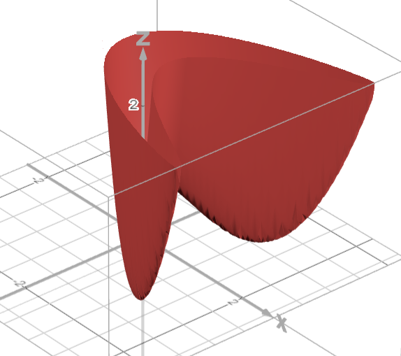
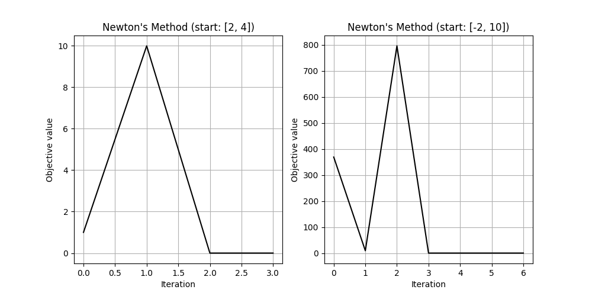
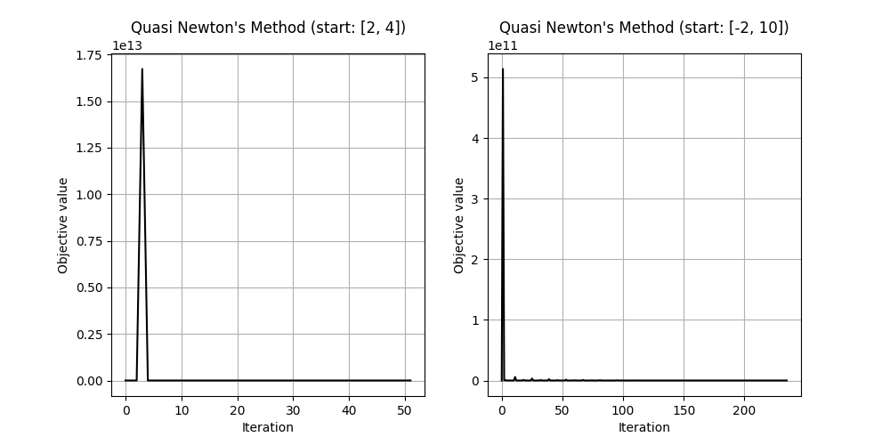

# Rosenbrock function using Newton's method

We implement gradient descent for minimization Rosenbrock function.
$10 \cdot  (x_1 - x_2^2)^2 + (1 - x_1)^2$



***
```calculate_objective(vector_x):``` function accepts a vector as an input, and return the f(x, y).

```compute_gradient(vector_x):``` function accepts a vector as an input, and return gradient $f(\overline x)^{\prime}_{x1}$ and $f(\overline x)^{\prime}_{x2}$ .


```compute_hessian(vector_x):``` function accepts a vector as an input, and return hessian. H = $\begin{bmatrix}
H_{11}& H_{12} \\
H_{21}& H_{22} \\
\end{bmatrix}$

$ H_{11} = f(\overline x)^{\prime}_{x1x1} = 120 \cdot x_1^2 - 40 \cdot x_2 + 2$

$ H_{12} = f(\overline x)^{\prime}_{x1x2} = -40 \cdot x_1$

$ H_{21} = H_{12} = f(\overline x)^{\prime}_{x2x1} = -40 \cdot x_1$

$ H_{22} = f(\overline x)^{\prime}_{x1x2} = 20$

***

It's took 3 iteration to find $x^*$ from [2, 4], and 6 iteration from [-2, 10].
$x^*$ = [1, 1]



***
# SR1 Quasi Newton's method

$$ B_{k+1} = B_k + \frac{(y_k - B_k \triangle x_k) \cdot (y_k - B_k \triangle x_k)^T}{(y_k - B_k \triangle x_k)^T\triangle x_k} $$

***
It's took 51 iteration to find $x^*$ from [2, 4], and 235 iteration from [-2, 10].
$x^*$ = [1, 1]




